# Dietify
Celem pracy było opracowanie systemu do zarzadzania dieta w architekturze
mikroserwisów. Aby osiagnac ten cel przeprowadzono analize istniejacych rozwiazan
konkurencyjnych, przedstawiono niezbedna wiedze domenowa oraz porównano popularne
style architektury aplikacji. Na podstawie zgromadzonej wiedzy wyszczególniono niezbedne
załozenia projektowe, zaprojektowano interfejs oraz zdefiniowano kategorie danych wraz
z regułami i ograniczeniami ich dotyczacymi. Nastepnie przedstawiono opis implementacji
powstałej na podstawie opracowanego projektu. W implementacji kluczowa role odegrały
jezyki Java i TypeScript, platforma deweloperska JHipster oraz stos technologii Netflix
OSS dla architektury mikroserwisów. Opracowane rozwiazanie moze zostac wykorzystane
przez dietetyków w celu przeprowadzania kompleksowej obsługi wizyty pacjenta z połozeniem
szczególnego nacisku na układanie jadłospisów i udostepnianie go pacjentom.

## Wymagania wstępne

-   [Node.js][]
-   [jdk11][]

## Instalacja
### Z Dockerem
Uruchom skrypt: 
    
    sh docker-compose/build-and-run-docker.sh
    
Następnie przejdź do adresu [http://localhost:8080](http://localhost:8080) w przeglądarce.

### Bez Dockera
Najpierw uruchom service discovery: 

    sh service-discovery/start-registry.sh
    
Następnie dla każdej aplikacji { gateway, products, recipes, mealplans, appointments } wykonaj w katalogu głównym aplikacji: 
    
    ./gradlew 

Następnie przejdź do adresu [http://localhost:8080](http://localhost:8080) w przeglądarce.

Żeby skorzystać z wykrywania zmian i automatycznego odświeżania frontendu aplikacji wykonaj poniższe polecania w katalogu głównym serwisu gateway:
    
    npm install && npm start

Następnie przejdź do adresu [http://localhost:9000](http://localhost:9000) w przeglądarce.

## Budowanie wersji produkcyjnej
Dla każdej aplikacji { gateway, products, recipes, mealplans, appointments } wykonaj w katalogu głównym aplikacji:
    
    ./gradlew -Pprod clean bootJar
    
## Założenia projektowe
### Użytkownicy systemu
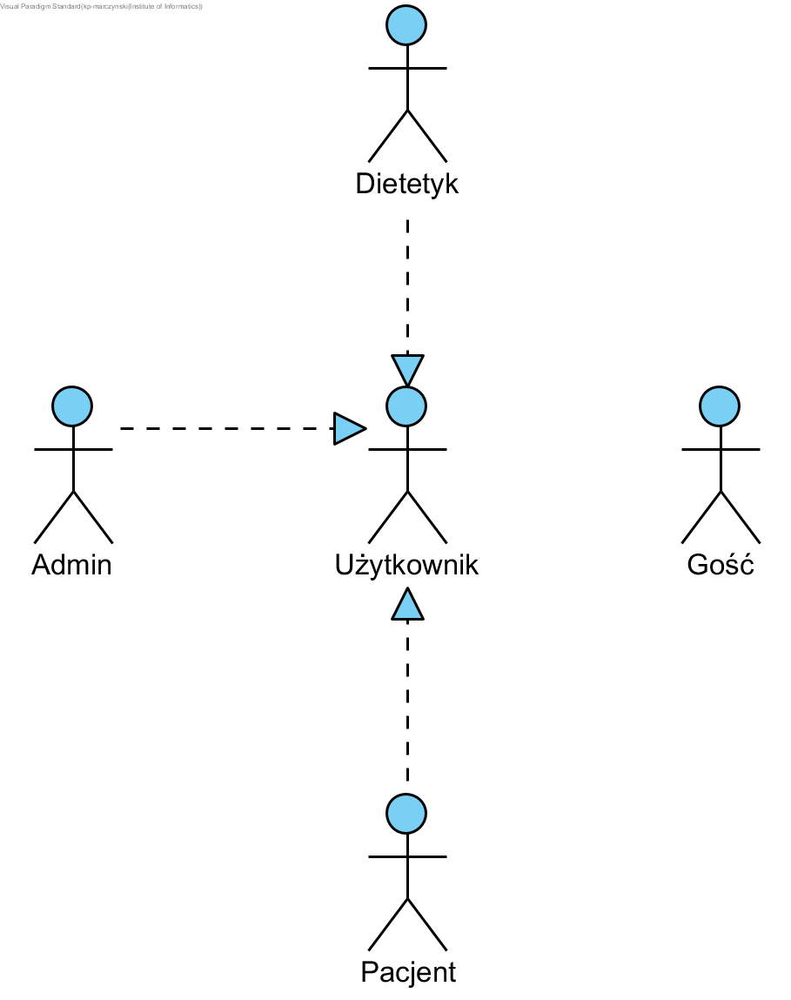

### Wymagania funkcjonalne
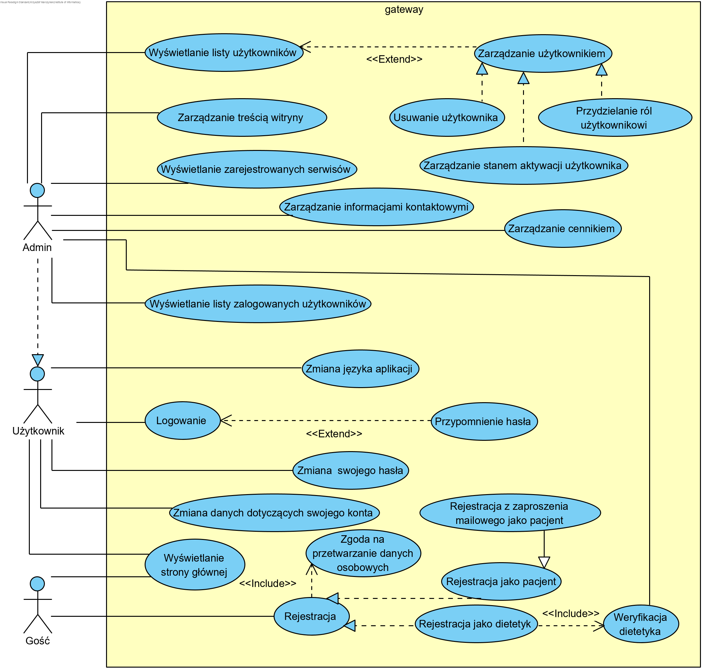
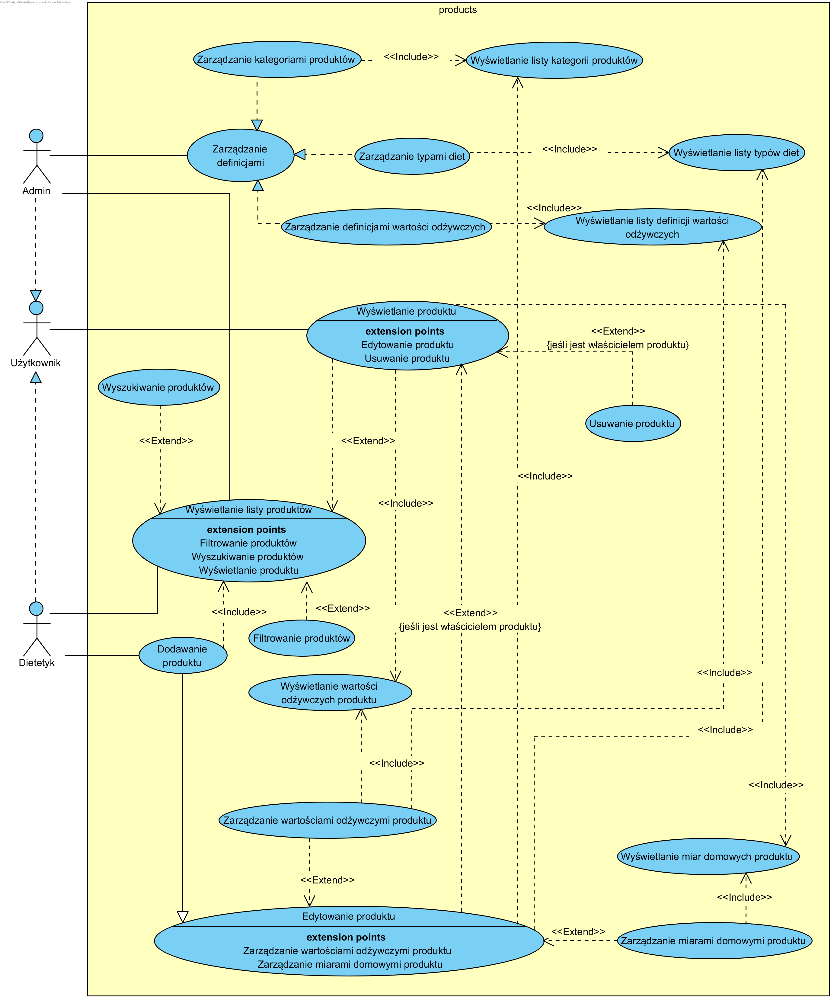
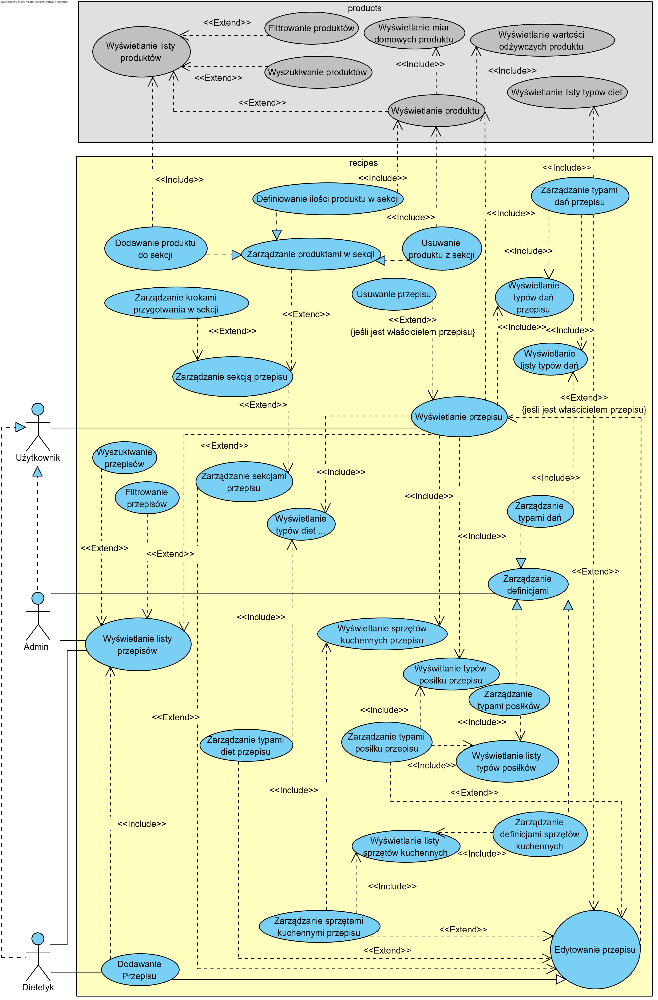
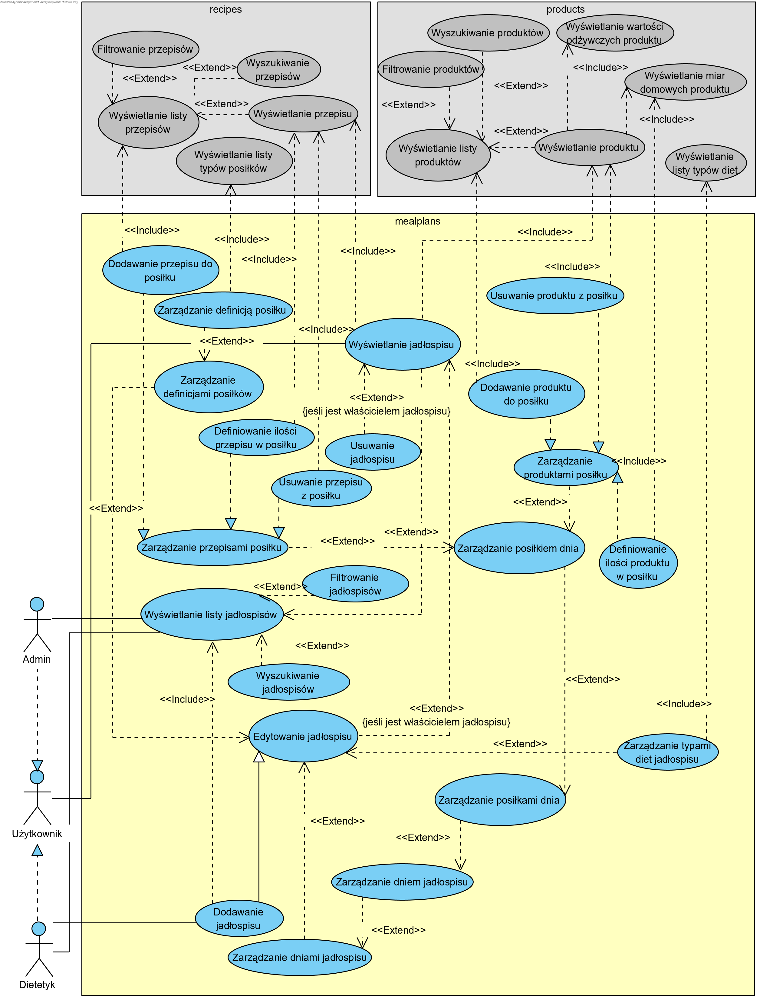
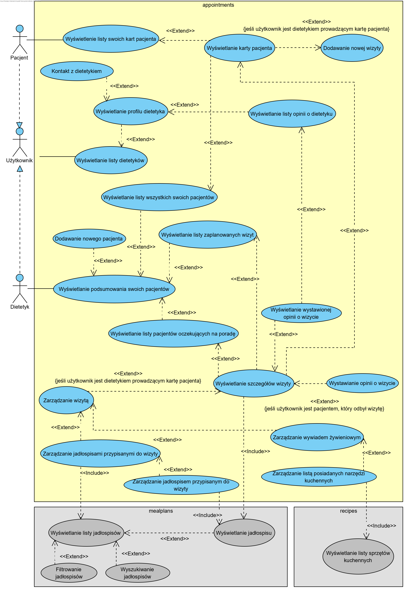

## Prototyp interfejsu
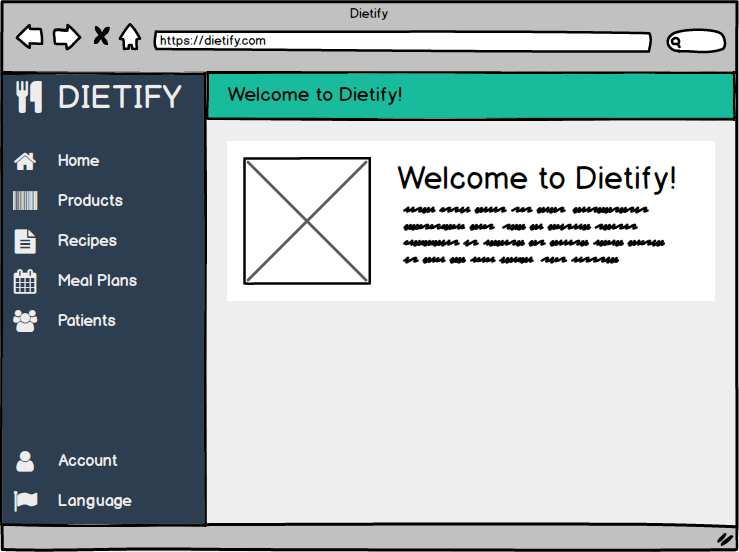
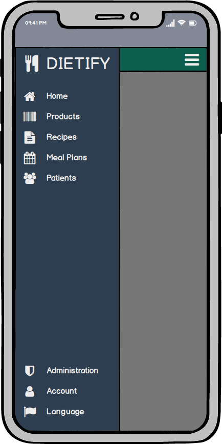
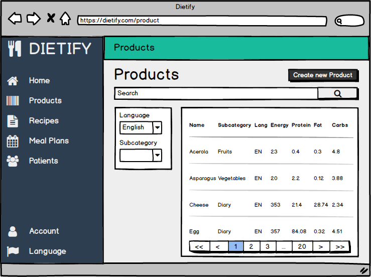
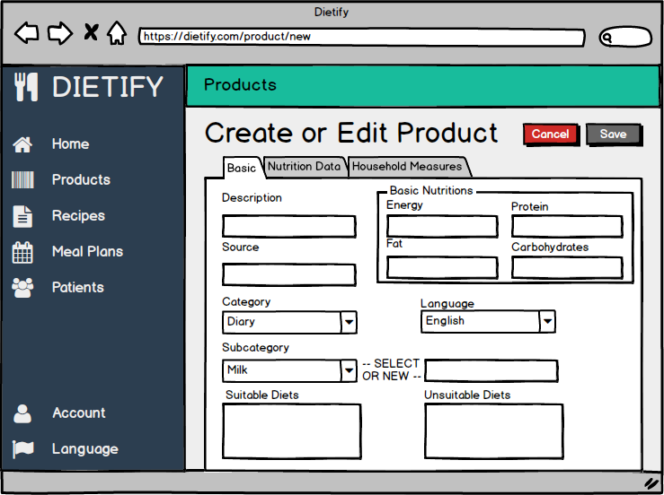
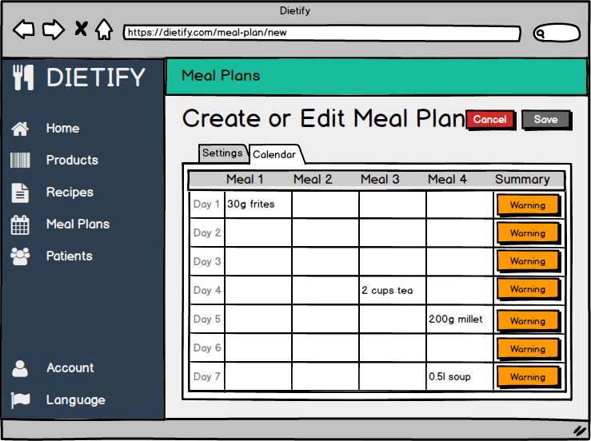

[node.js]: https://nodejs.org/
[jdk11]: https://openjdk.java.net/projects/jdk/11/
