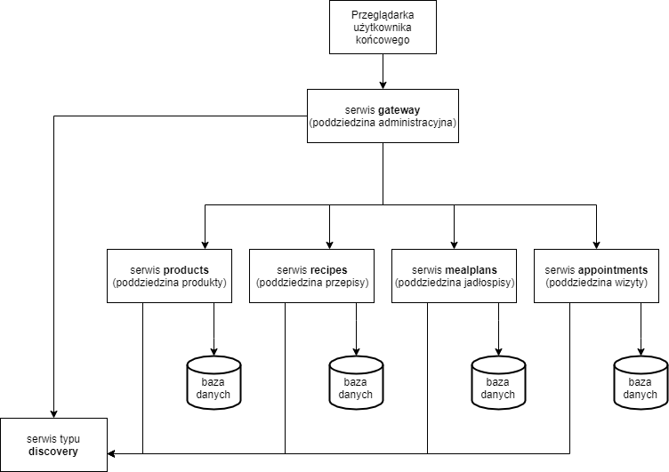
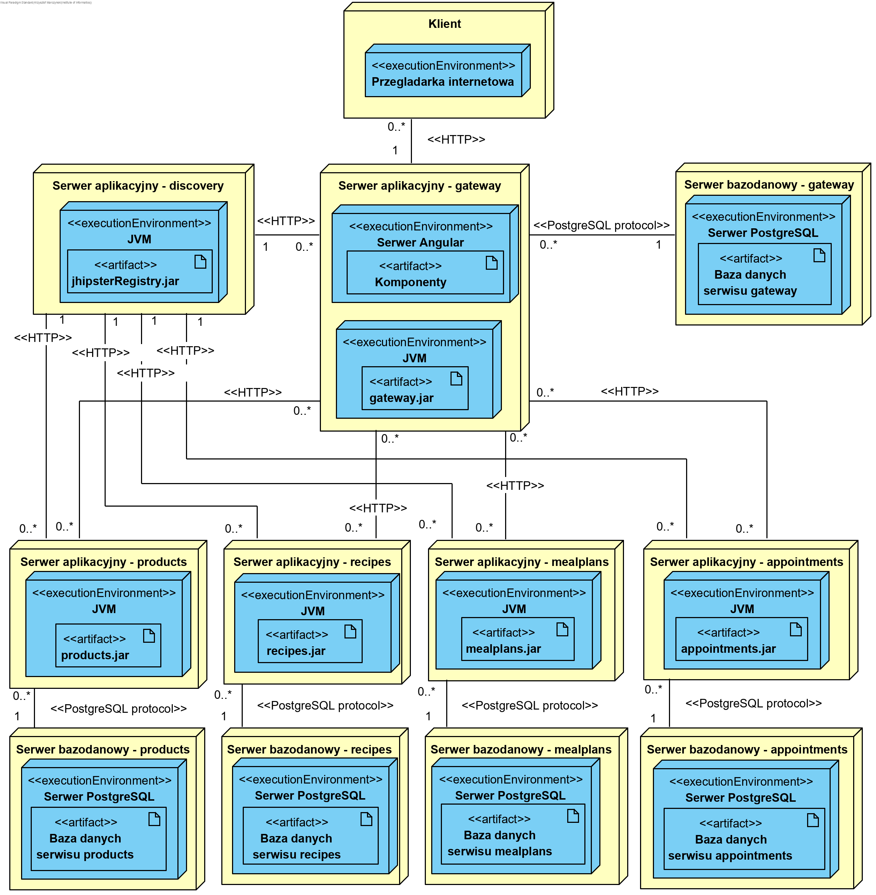
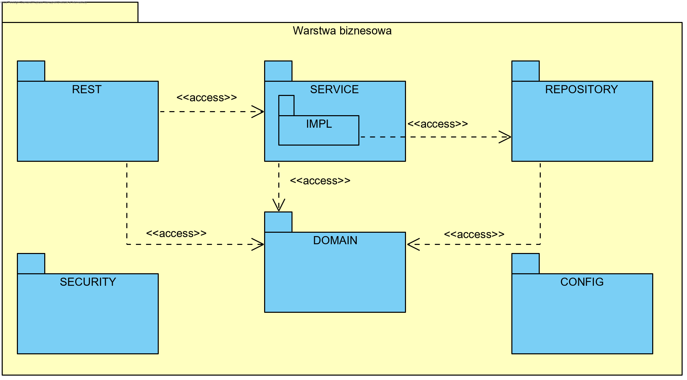
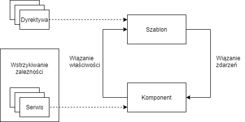
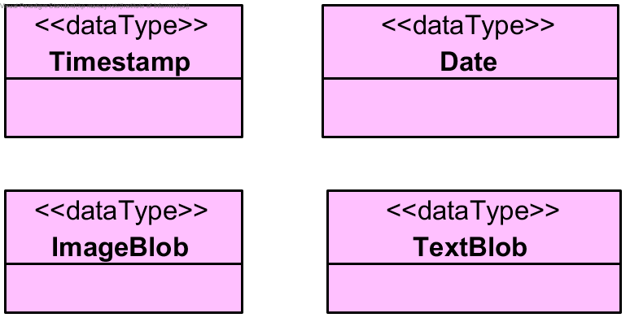
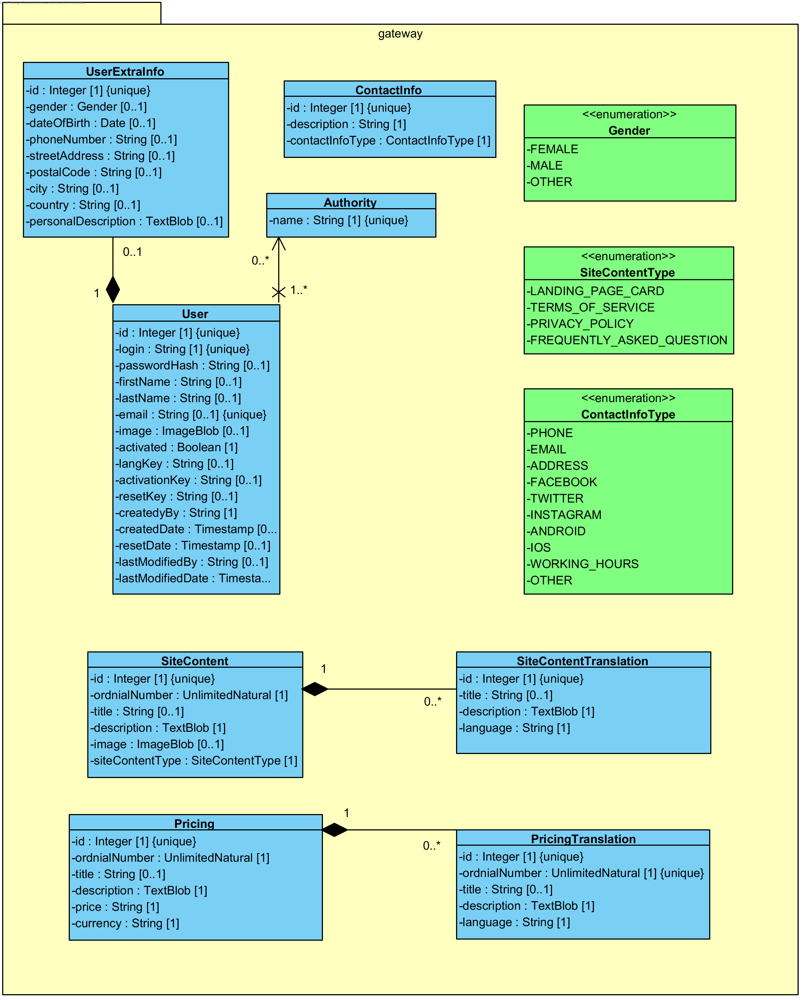
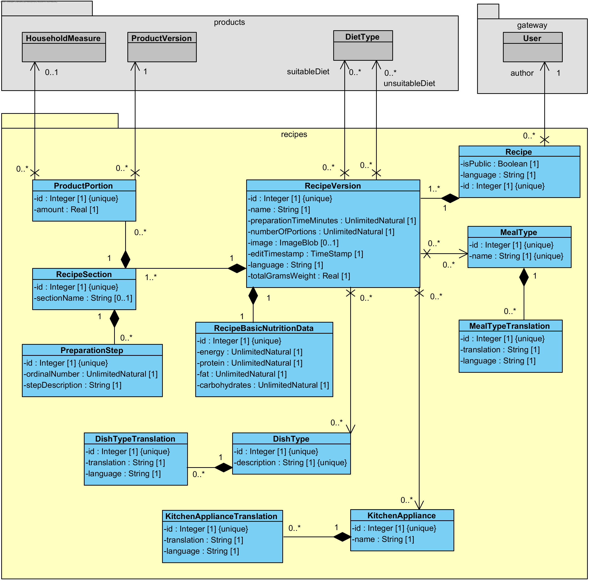
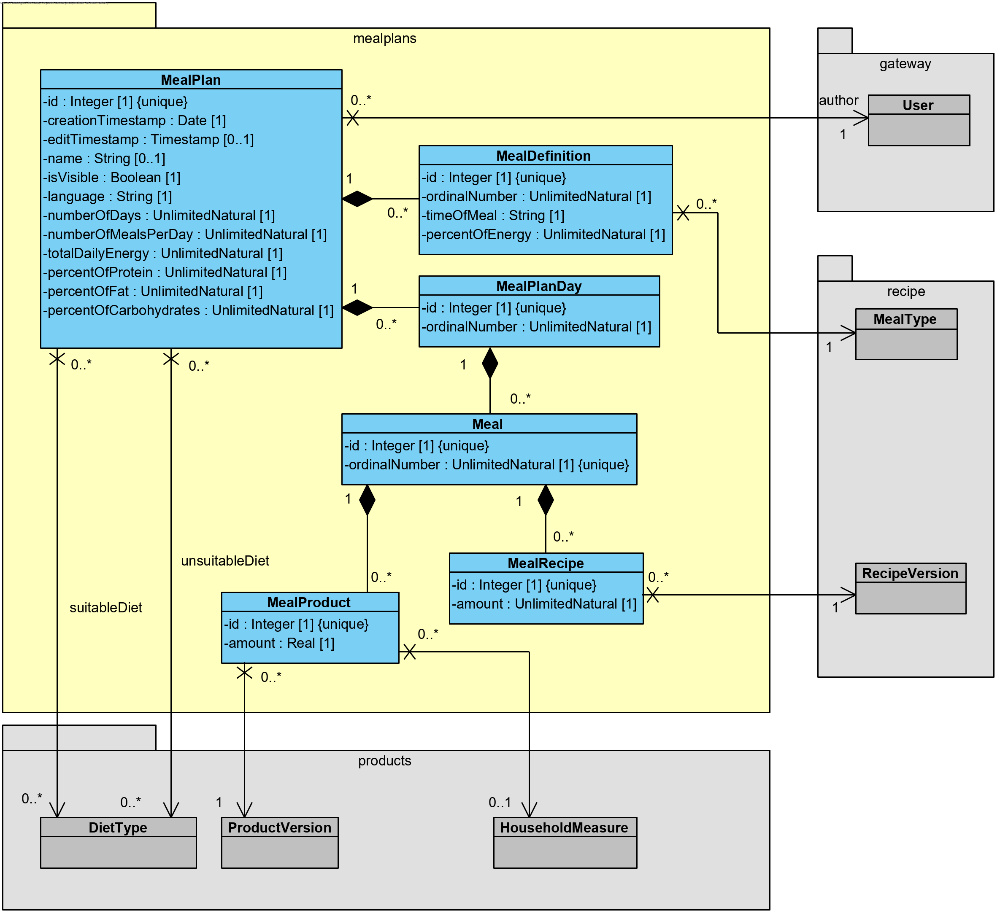
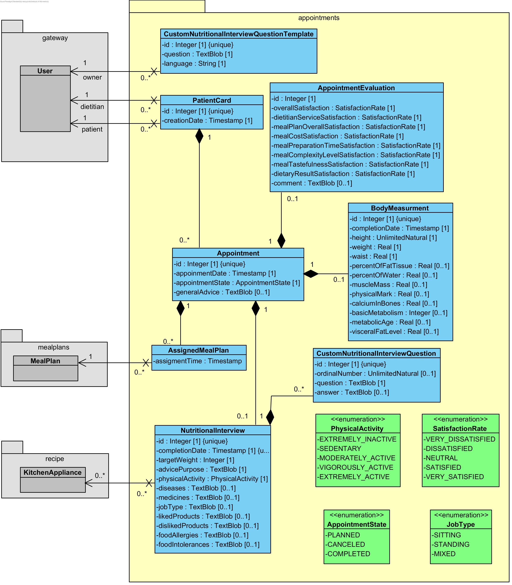

# Dietify
Celem pracy było opracowanie systemu do zarządzania dietą w architekturze
mikroserwisów. Aby osiągnąć ten cel przeprowadzono analizę istniejących rozwiązań
konkurencyjnych, przedstawiono niezbędną wiedzę domenową oraz porównano popularne
style architektury aplikacji. Na podstawie zgromadzonej wiedzy wyszczególniono niezbędne
założenia projektowe, zaprojektowano interfejs oraz zdefiniowano kategorie danych wraz
z regułami i ograniczeniami ich dotyczącymi. Następnie przedstawiono opis implementacji
powstałej na podstawie opracowanego projektu. W implementacji kluczową rolę odegrały
języki Java i TypeScript, platforma deweloperska JHipster oraz stos technologii Netflix
OSS dla architektury mikroserwisów. Opracowane rozwiązanie może zostać wykorzystane
przez dietetyków w celu przeprowadzania kompleksowej obsługi wizyty pacjenta z położeniem
szczególnego nacisku na układanie jadłospisów i udostępnianie go pacjentom.

## Wymagania wstępne

-   [Node.js][]
-   [jdk11][]

## Instalacja
### Z Dockerem
Uruchom skrypt: 
    
    sh docker-compose/build-and-run-docker.sh
    
Następnie przejdź do adresu [http://localhost:8080](http://localhost:8080) w przeglądarce.

### Bez Dockera
Najpierw uruchom service discovery: 

    sh service-discovery/start-registry.sh
    
Następnie dla każdej aplikacji { gateway, products, recipes, mealplans, appointments } wykonaj w katalogu głównym aplikacji: 
    
    ./gradlew 

Następnie przejdź do adresu [http://localhost:8080](http://localhost:8080) w przeglądarce.

Żeby skorzystać z wykrywania zmian i automatycznego odświeżania frontendu aplikacji wykonaj poniższe polecania w katalogu głównym serwisu gateway:
    
    npm install && npm start

Następnie przejdź do adresu [http://localhost:9000](http://localhost:9000) w przeglądarce.

## Budowanie wersji produkcyjnej
Dla każdej aplikacji { gateway, products, recipes, mealplans, appointments } wykonaj w katalogu głównym aplikacji:
    
    ./gradlew -Pprod clean bootJar

## Założenia projektowe
### Dekompozycja problemu w oparciu o poddziedziny
Na podstawie wywiadu z dietetykiem, analizy rozwiązań konkurencyjnych oraz opierając
się na wzorcu dekompozycji problemu w oparciu o poddziedziny
dla omawianej aplikacji wspomagania zarządzania dietą można wyszczególnić następujące
poddziedziny:
* poddziedzina administracyjna - służąca jako brama aplikacji, pozwalająca na
zarządzanie użytkownikami i administrowanie aplikacją,
* poddziedzina produkty - skupiająca się na zarządzaniu produktami spożywczymi, ich
wartościami odżywczymi i miarami domowymi,
* poddziedzina przepisy - pozwalająca na zarządzanie przepisami, w tym przypisywanie
do przepisów produktów,
* poddziedzina jadłospisy - pozwalająca na zarządzanie jadłospisami, w tym przypisywanie
do jadłospisów produktów i przepisów,
* poddziedzina wizyty - skupiająca się na całościowym zarządzaniu wizytami pacjenta
w obrębie karty pacjenta, a w szczególności przypisywaniem do wizyty jadłospisów,
przeprowadzaniem wywiadu żywieniowego oraz zbieraniem pomiarów ciała pacjenta.

### Użytkownicy systemu

### Wymagania funkcjonalne

## Architektura systemu
### Ogólna architektura

### Diagram rozmieszczenia

### Architektura backendu

### Architektura frontendu

## Projekt bazy danych

## Prototyp interfejsu

[node.js]: https://nodejs.org/
[jdk11]: https://openjdk.java.net/projects/jdk/11/
